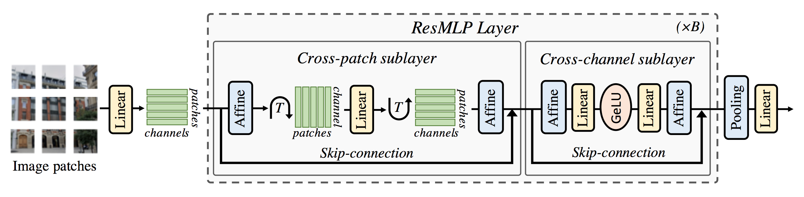

## Vision
Building blocks for computer vision research.
___
### Models

#### Vision Transformer [](https://arxiv.org/abs/2010.11929)

<p align="center">
  
</p>


```bash
python -m vision.train --model='vit.ViT' ...
```

#### ResMLP [](https://arxiv.org/abs/2105.03404)

<p align="center">
  
</p>

```bash
python -m vision.train --model='resmlp.ResMLP' ...
```

#### MLPMixer [](https://arxiv.org/abs/2105.01601)

<p align="center">
  
</p>

```bash
python -m vision.train --model='mlpmixer.MLPMixer' ...
```

#### ConvMixer [](https://arxiv.org/abs/2201.09792)
WIP

#### ConvNeXt [](https://arxiv.org/abs/2201.03545)
WIP

___

## Datasets

- #### MedMNISTv2
- #### PascalVOC
- #### Tiny ImageNet

___
## Experiments

WIP
